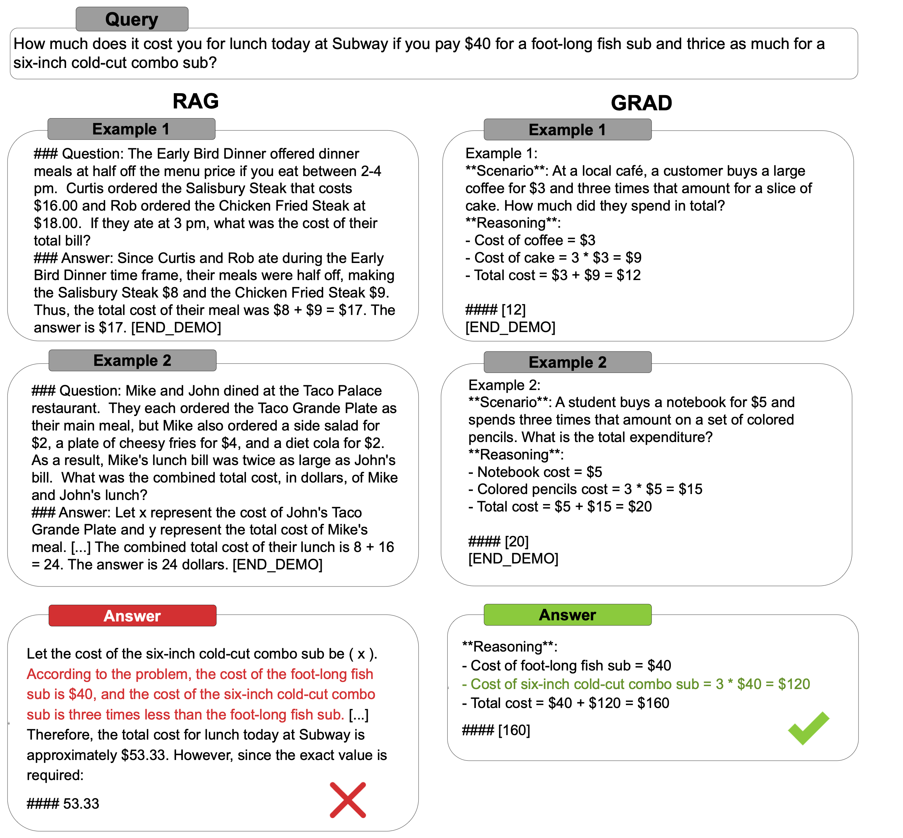

## This is the official repository for the paper [GRAD: Generative Retrieval-Aligned Demonstration Sampler for Efficient Few-Shot Reasoning](https://arxiv.org/abs/2510.01165)
**Authors:** Oussama Gabouj, Kamel Charaf, Ivan Zakazov, Nicolas Baldwin, Robert West

---

## Why GRAD?

### Manual Few-shot Prompting:
- ❌ Tedious and time-consuming.
- ❌ Hard to scale across tasks.
- ❌ Requires careful prompt design.

### RAG-based Few-shot Prompting:
- ❌ Requires building a database.
- ❌ Database maintenance is costly.
- ❌ Hard to find relevant documents.

### GRAD Does the Heavy Lifting:
- ✅ Provides shorter demos & outputs.
- ✅ No database / RAG needed.
- ✅ Scales across tasks and domains.

---

## Example (see more here: [Examples](examples.md)).

GRAD (Generative Retrieval-Aligned Demonstration Sampler) is an efficient approach to few-shot reasoning that eliminates the need for expensive database construction and maintenance while providing more effective demonstration selection for large language models.

<div align="center">
  
  <p><em>Figure: GRAD architecture and workflow</em></p>
</div>

---

## Citation

If you find GRAD helpful for your research, please consider giving a citation:

```bibtex
@misc{gabouj2025gradgenerativeretrievalaligneddemonstration,
      title={GRAD: Generative Retrieval-Aligned Demonstration Sampler for Efficient Few-Shot Reasoning}, 
      author={Oussama Gabouj and Kamel Charaf and Ivan Zakazov and Nicolas Baldwin and Robert West},
      year={2025},
      eprint={2510.01165},
      archivePrefix={arXiv},
      primaryClass={cs.CL},
      url={https://arxiv.org/abs/2510.01165}, 
}
```

